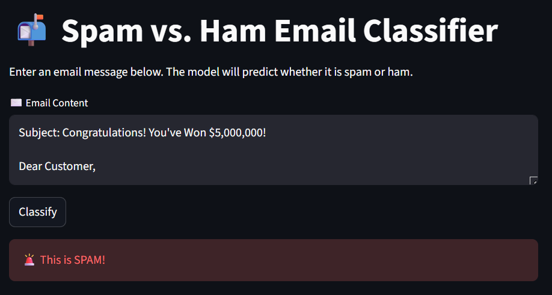

# 📬 Email Spam Classification using Machine Learning

A complete end-to-end Machine Learning project that classifies email messages as **Spam** or **Ham (Not Spam)** using Natural Language Processing (NLP) techniques and an interactive Streamlit web interface.

---

## 📖 Project Overview

Spam detection is one of the most practical real-world NLP classification problems.

This project demonstrates:

- Text preprocessing  
- Feature extraction using TF-IDF  
- Probabilistic classification using Naive Bayes  
- Model serialization  
- Web deployment with Streamlit  

The system predicts whether an email is:

- 🚨 **Spam**
- ✅ **Ham (Not Spam)**

---

## 🧠 Machine Learning Workflow

### 1️⃣ Data Preprocessing
- Convert text to lowercase  
- Remove numbers  
- Remove punctuation  
- Remove special characters  

### 2️⃣ Feature Engineering
- TF-IDF Vectorization  
- Converts textual data into numerical feature vectors  
- Captures word importance across documents  

### 3️⃣ Model Used
- Multinomial Naive Bayes  
- Efficient for text classification  
- Works well with high-dimensional sparse data  

### 4️⃣ Model Evaluation
Performance evaluated using:

- Precision  
- Recall  
- F1-Score  
- Classification Report  

---

## 📊 Dataset Information

- SMS Spam Collection Dataset  
- Cleaned and structured  
- Balanced before training  
- Stored inside `dataset/spam.csv`

Example dataset format:

| Label | Text |
|-------|------|
| spam  | Congratulations! You have won... |
| ham   | Hey, are we meeting today? |

---

## 📂 Project Structure

```
Email-Spam-Classification-ML/
│
├── app.py
├── train_model.py
├── requirements.txt
├── README.md
│
├── dataset/
│   └── spam.csv
│
├── models/
│   └── spam_classifier.pkl
│
├── screenshots/
│   └── app_preview.png
```

---

## ⚙️ Installation

### 1️⃣ Clone Repository

```bash
git clone https://github.com/your-username/Email-Spam-Classification-ML.git
cd Email-Spam-Classification-ML
```

### 2️⃣ Install Dependencies

```bash
pip install -r requirements.txt
```

---

## 🏋️ Train the Model

```bash
python train_model.py
```

This generates:

```
models/spam_classifier.pkl
```

---

## 🌐 Run the Web Application

```bash
streamlit run app.py
```

Then open your browser:

```
http://localhost:8501
```

---

## 🖥 Application Preview



---

## 📈 Why Naive Bayes Works Well for Spam Detection

Naive Bayes performs efficiently for spam detection because:

- It models word probabilities
- Works well with text frequency features
- Handles large vocabularies efficiently
- Fast training and prediction

---

## 🛠 Technologies Used

- Python  
- Pandas  
- Scikit-learn  
- TF-IDF Vectorizer  
- Multinomial Naive Bayes  
- Streamlit  
- Pickle  

---

## 🎯 Skills Demonstrated

- Natural Language Processing (NLP)  
- Text Cleaning & Preprocessing  
- Feature Engineering  
- Machine Learning Pipeline Design  
- Model Serialization  
- Web App Deployment  
- Clean Project Structuring  

---

## 🔮 Future Improvements

- Add Confusion Matrix Visualization  
- Compare with Logistic Regression / SVM  
- Upgrade to Deep Learning (LSTM / BERT)  
- Deploy to Streamlit Cloud  
- Add REST API version  
- Add Docker support  

---

## 👨‍💻 Author

**Muhammed Rashad P**  
Data Enthusiast | AI & ML Developer  

📧 rashadchr@gmail.com  
🔗 LinkedIn: (Add your link)  
🔗 GitHub: (Add your profile link)  

---

⭐ If you found this project useful, consider giving it a star on GitHub.
